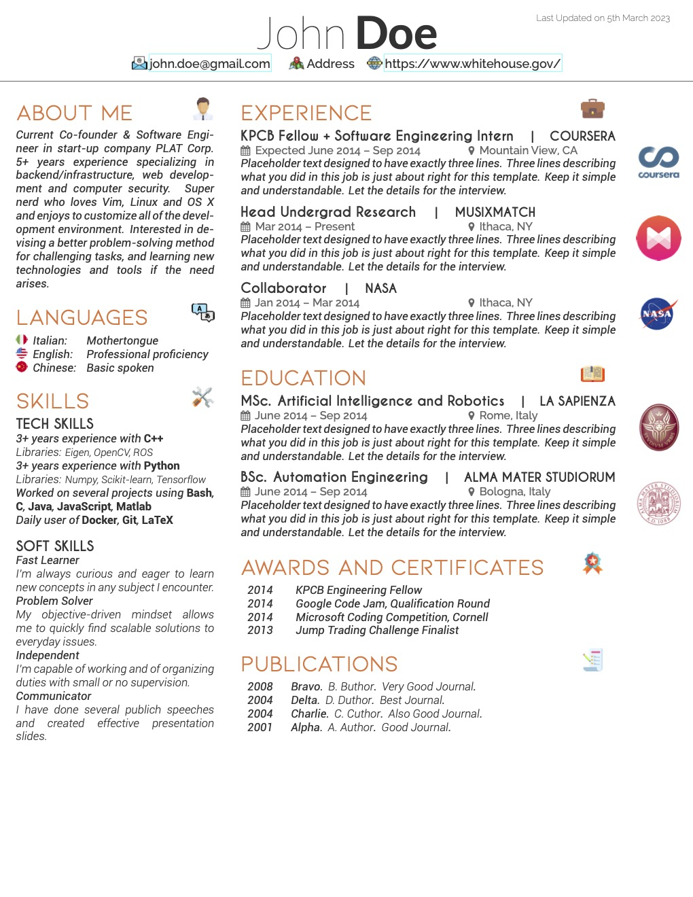

# latex-scientific-resume

Install Latex and `make`

```
sudo apt-get update
sudo apt-get install make texlive-full
```

Latex template for a one-page, two-columns, scientific resume

In your LaTeX editor, build the resume using XeLaTeX

or just run 

```
make
```



Header icons made by [Freepik](https://www.freepik.com/) from [Flaticon](https://www.flaticon.com) are licensed by [CC 3.0 BY](http://creativecommons.org/licenses/by/3.0/).
